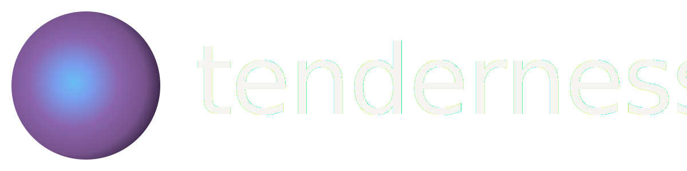

<picture>
  <source media="(prefers-color-scheme: dark)" srcset="docs/assets/logo/tenderness-lockup-horizontal-dark.svg">
  <source media="(prefers-color-scheme: light)" srcset="docs/assets/logo/tenderness-lockup-horizontal-light.svg">
  
</picture>

  
  
  
  
  

  
  
  
  
  
  

**tenderness** is a fast library for *synthetic*, deterministic document rendering from text and images, powered by [Cairo](https://www.cairographics.org/) and [Pango](https://docs.gtk.org/Pango/index.html).

## Why tenderness?

Most document datasets don’t come from real structure — they come from reconstruction. Text is rendered, then reverse-engineered back into layout using OCR, heuristics, or fragile parsing pipelines. The result is noisy, incomplete, and not reproducible.

**tenderness** flips this entirely.

It renders text directly into documents producing images, SVGs, and PDFs with fully known layout from the start. Every character placement, line break, and block position is defined at render time — not inferred afterward.

## What this gives you

- Generate large-scale synthetic document datasets
- Provide precise structural supervision for vision-language models
- Build benchmarks for layout understanding systems
- Ground-truth layout across characters, clusters, runs, and lines

**No OCR. No heuristics. No reconstruction. No manual annotation.**

Just text in → fully structured document out.

## Main Features

 - **Multi-format output**: Render text and images into Image, SVG, PDF, or NumPy arrays.

 - **Composable content blocks**: Build documents from simple primitives: `TextBlock`, `ImageBlock`, and `TableBlock`.

 - **Minimal flexbox layout engine**: A lightweight system that automatically resolves positioning and flow.

 - **Exact bounding boxes (OBB + AABB, logical + ink)**: Extract multi-level data for text (character, cluster, run, line, layout) and blocks.

 - **Rich typography & text flow**: Custom fonts, hierarchical styling, Pango markup, automatic font fallback, and overflow-aware text continuation across blocks.

 - **Composable pipelines**: Use the built-in pipeline with pre-defined layouts, or build your own from scratch.