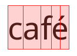
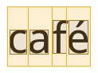
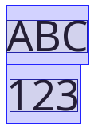
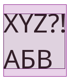

# Bounding boxes
This page describes the different types of bounding boxes that **tenderness** provides for text and blocks.

## Text bounding boxes (OBB)

All text bounding boxes are oriented bounding boxes (OBB). They capture exact text shape and orientation — even when rotated or skewed.

### Char
The fundamental unit of text — a single Unicode code point. Provides a `logical` bounding box only.
<figure markdown="span">
{ loading=lazy }
<figcaption>Example: café has 5 characters (c-a-f-e-´).</figcaption>
</figure>

### Cluster
An indivisible visual unit — one or more characters that render as a single glyph or shape, such as a ligature (`fi`), a diacritic (`é`), or a combined emoji (`👨‍👩‍👦`). Provides `logical` and `ink` bounding boxes.
<figure markdown="span">
{ loading=lazy }
<figcaption>Example: café has 4 clusters (c-a-f-é).</figcaption>
</figure>

### Run
A contiguous sequence of clusters sharing the same font, style, script, and text direction. Provides `logical` and `ink` bounding boxes.
<figure markdown="span">
{ loading=lazy }
<figcaption>Example: Hello 你好 has 2 runs (Hello and 你好).</figcaption>
</figure>

### Line
A single physical row of text, determined after word-wrapping is applied. Provides `logical` and `ink` bounding boxes.
<figure markdown="span">
{ loading=lazy }
<figcaption>Example: ABC\n123 has 2 lines (ABC and 123).</figcaption>
</figure>

### Layout
The full extent of a text block — the union of all its lines. Provides `logical` and `ink` bounding boxes.
<figure markdown="span">
{ loading=lazy }
<figcaption>Example: XZY?!\nАБВ has 1 layout.</figcaption>
</figure>

## Block bounding boxes (AABB)
Block bounding boxes are axis-aligned bounding boxes (AABB). They define the position and size of each block within the document layout.